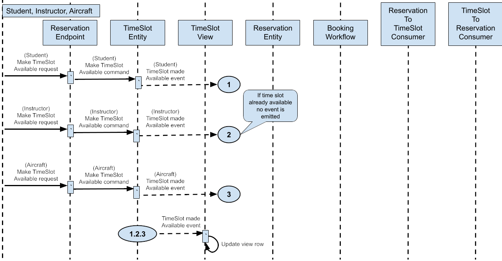
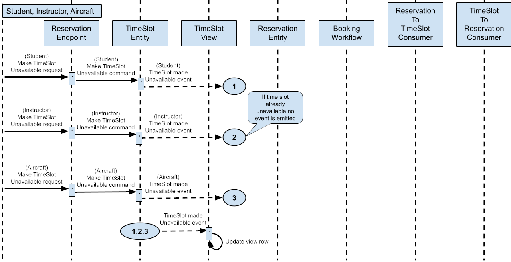
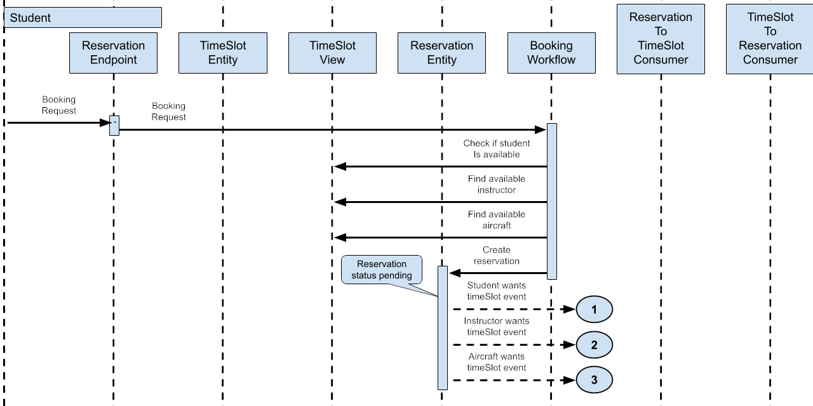
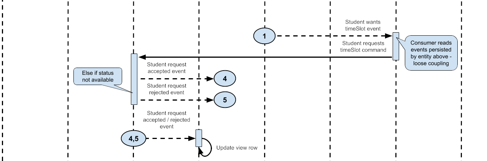
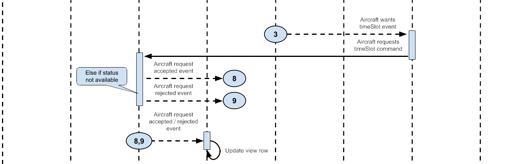
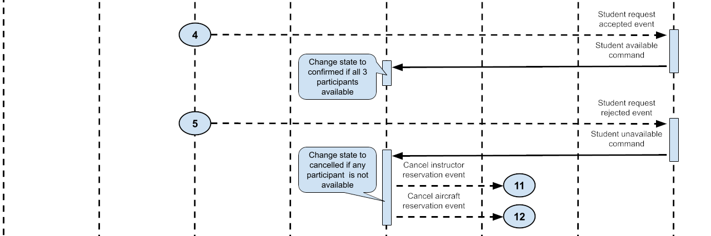
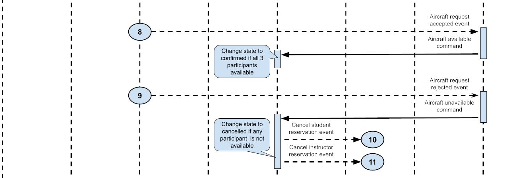
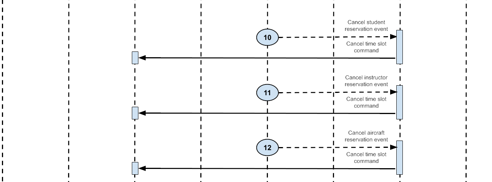
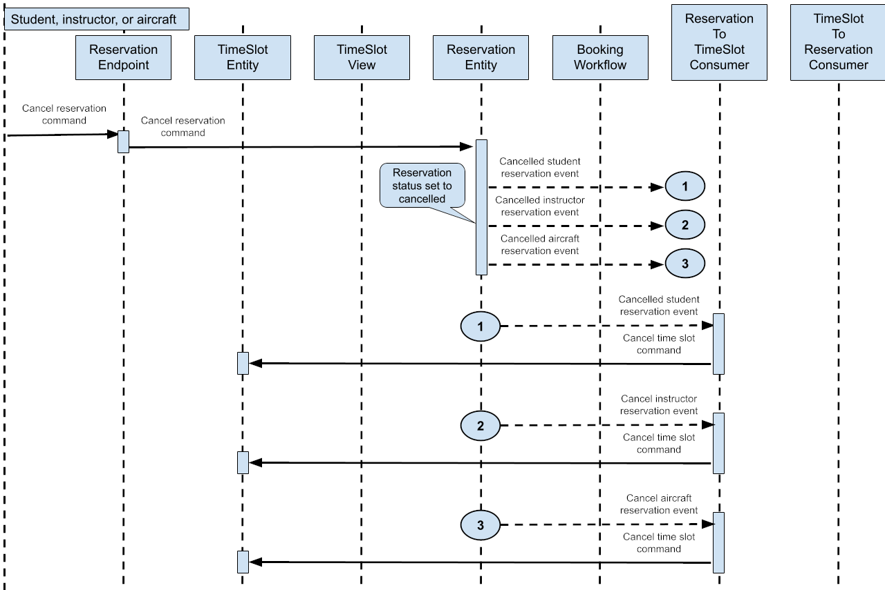

# How to Get Certified

The Flight Training Scheduler project serves as the certification test for Akka developers. This certification process evaluates your ability to implement a real-world application using Akka SDK components.

## Getting Started

Clone this template repository, which contains:

* Project structure and configuration
* Documentation and requirements
* Test suite
* All non-Akka components

### Certification Requirements

Your task is to implement the following Akka SDK components:

* Reservation endpoint
* Time slot entity
* Reservation entity
* Booking workflow
* TimeSlot view
* Reservation to time slot consumer
* Time slot to reservation consumer

### Implementation Guidelines

* Adhere to the design specifications for each component
* Ensure all components work together as described
* Pass all provided test cases
* Maintain proper event flow and state management
* Handle all required operations correctly

### Submission Process

1. Complete your implementation
2. Test thoroughly using the provided test suite
3. Upload your completed project to a public repository (e.g., GitHub)
4. Email [certification@akka.io](mailto:certification@akka.io) with:
   * Your contact information
   * Link to your public repository

### Evaluation

The certification team will review your implementation for:

* Correct functionality
* Proper use of Akka SDK components
* Code quality and organization
* Adherence to specified requirements
* Successful test completion

## Flight Training Scheduler App Design

The Flight Training Scheduler manages flight training sessions by coordinating the availability and commitment of three participants: students, instructors, and aircraft. All interactions with the system occur through an HTTP endpoint:

<table>
<tr>
<th>Type</th>
<th>Relative URL</th>
<th>Parameters</th>
</tr>
<tr>
<td>POST</td>
<td>/flight/booking<br/><br/><code>curl -X POST \
'http://localhost:9000/flight/booking' \
-H 'Content-Type: application/json' \
-d '{
      "reservationId": "ABC123",
      "studentId": "student-123",
      "reservationTime": "2024-03-20T14:00:00Z"
      }'
</code></td>
<td><code>
String reservationId
String studentId
Instant reservationTime
</code></td>
</tr>
<tr>
<td>POST</td>
<td>/flight/reservation<br/><br/><code>curl -X POST \
'http://localhost:9000/flight/reservation' \
-H 'Content-Type: application/json' \
-d '{
      "reservationId": "ABC123",
      "studentId": "student-123",
      "studentTimeSlotId": "slot-s-123",
      "instructorId": "instructor-456",
      "instructorTimeSlotId": "slot-i-456",
      "aircraftId": "aircraft-789",
      "aircraftTimeSlotId": "slot-a-789",
      "reservationTime": "2024-03-20T14:00:00Z"
    }'</code></td>
<td><code>
String reservationId
String studentId
String studentTimeSlotId
String instructorId
String instructorTimeSlotId
String aircraftId
String aircraftTimeSlotId
Instant reservationTime
</code></td>
</tr>
<tr>
<td>PUT</td>
<td>/flight/reservation-cancel<br/><br/><code>curl -X PUT \
'http://localhost:9000/flight/reservation-cancel' \
-H 'Content-Type: application/json' \
-d '{
      "reservationId": "ABC123"
    }'</code></td>
<td><code>
String reservationId</code></td>
</tr>
<tr>
<td>GET</td>
<td>/flight/reservation<br/><br/><code>curl -X GET \
'http://localhost:8080/flight/reservation/res-123'</code></td>
<td><code>
String reservationId</code></td>
</tr>
<tr>
<td>POST</td>
<td>/flight/make-time-slot-available<br/><br/><code>curl -X POST \
'http://localhost:8080/flight/make-time-slot-available' \
-H 'Content-Type: application/json' \
-d '{
      "timeSlotId": "ts-123",
      "participantId": "instructor-456",
      "participantType": "instructor",
      "startTime": "2024-03-20T14:00:00Z"
    }'</code></td>
<td><code>
String timeSlotId
String participantId
Enum participantType
Instant startTime
</code></td>
</tr>
<tr>
<td>PUT</td>
<td>/flight/make-time-slot-unavailable<br/><br/><code>curl -X PUT \
'http://localhost:8080/flight/make-time-slot-unavailable' \
-H 'Content-Type: application/json' \
-d '{
      "timeSlotId": "ts-123"
    }'</code></td>
<td><code>
String timeSlotId</code></td>
</tr>
<tr>
<td>GET</td>
<td>/flight/time-slot<br/><br/><code>curl -X GET \
'http://localhost:8080/flight/time-slot/ts-123'</code></td>
<td><code>
String timeSlotId</code></td>
</tr>
<tr>
<td>GET</td>
<td>/flight/time-slot-view-all<br/><br/><code>curl -X GET \
'http://localhost:8080/flight/time-slot-view-all'</code></td>
<td></td>
</tr>
<tr>
<td>POST</td>
<td>/flight/time-slot-view-by-type-and-time-range<br/><br/><code>curl -X POST \
'http://localhost:9000/flight/time-slot-view-by-type-and-time-range' \
-H 'Content-Type: application/json' \
-d '{
      "participantType": "instructor",
      "timeBegin": "2024-03-20T00:00:00Z",
      "timeEnd": "2024-03-21T00:00:00Z"
    }'</code></td>
<td><code>
String participantType
Instant timeBegin
Instant timeEnd</code></td>
</tr>
<tr>
<td>POST</td>
<td>/flight/time-slot-view-by-participant-and-time-range<br/><br/><code>curl -X POST \
'http://localhost:8080/flight/time-slot-view-by-participant-and-time-range' \
-H 'Content-Type: application/json' \
-d '{
      "participantId": "instructor123",
      "participantType": "INSTRUCTOR",
      "timeBegin": "2024-03-20T00:00:00Z",
      "timeEnd": "2024-03-21T00:00:00Z"
    }'</code></td>
<td><code>
String participantId
String participantType
Instant timeBegin
Instant timeEnd</code></td>
</tr>
</table>

## Flight Training Scheduler Core Functions

The provided template repository contains all the business logic defined in domain objects. Do not modify the provided domain objects, your objective is to implement the necessary Akka SDK components that interact with the domain objects, processing requests, commands, and events.

### Availability Management

The application allows all participants to indicate their available time slots in a calendar system. Each participant can mark when they are free for one-hour training sessions, creating a pool of available time slots for each participant type.

### Reservation System

Students can browse available time slots and create reservations. The system ensures that a valid reservation can only be created when all three required participants (student, instructor, and aircraft) have marked availability for the same time slot. Reservations are always for future time slots and last precisely one hour.

## Flight Training Scheduler Business Rules

### Scheduling Logic

* All reservations require exactly three participants: one each of student, instructor, and aircraft
* Time slots start on the hour
* Time slots are fixed at a one-hour duration
* Participants can have multiple reservations
* Consecutive time slots are allowed
* No approval workflow is required
* No qualification matching is needed between participants

### Reservation Management

* Reservations can only be created for future time slots
* Existing reservations can be canceled but not modified
* Cancellations can occur for any reason
* There are no restrictions on how far in advance slots can be booked

The system maintains consistency through Akka's concurrency management, ensuring double bookings cannot occur, and all participants remain correctly scheduled.

## Flight Training Scheduler Components to Implement

The Flight Training Scheduler application requires you to create 7 components with a single entry point (the Endpoint) and interact with one another through requests, commands, and events.


This component-based architecture leverages Akka SDK's capabilities to create a scalable, event-driven system that manages the complexities of flight training scheduling. Each component has a clear responsibility, promoting modularity and maintainability in the application design.

### Reservation Endpoint

* Defines the external API for the service
* Implemented as an Akka SDK HTTP Endpoint component
* Handles incoming HTTP requests for reservation-related operations
* Routes requests to appropriate internal components
* The integration point for the included scheduling GUI

### TimeSlot Entity

* Represents individual one-hour time slots for participants (students, instructors, aircraft)
* Implemented as an Akka SDK Event sourced entity component
* Attributes:
  * timeSlotId: Unique identifier for the time slot
  * participantId: ID of the associated participant
  * participantType: Enum (student, instructor, or aircraft)
  * startTime: Beginning of the time slot
  * status: Enum (available, unavailable, scheduled)
  * reservationId: Associated reservation (if scheduled)

### Reservation Entity

* Represents a flight lesson reservation
* Implemented as an Akka SDK Event sourced entity component
* Attributes:
  * reservationId: Unique identifier for the reservation
  * studentParticipant: Participant record (id, type, timeSlotId, status)
  * instructorParticipant: Participant record
  * aircraftParticipant: Participant record
  * reservationTime: Time of the reservation
  * status: Enum (pending, confirmed, cancelled)

### Booking Workflow

* Defines the steps for creating a new reservation
* Implemented as an Akka SDK Workflow component
* Workflow steps:
  1. Query TimeSlot view for student availability
  2. Query TimeSlot view for available instructors
  3. Query TimeSlot view for available aircraft
  4. If all participants are available, create a reservation

### TimeSlot View

* Consumes TimeSlot events and projects them into a view table
* Implemented as an Akka SDK View component
* Provides a query interface for accessing time slot data
* Supports various queries to facilitate the booking workflow

```sql
SELECT * as timeSlots
  FROM time_slot_view
 WHERE participantId = :participantId
   AND participantType = :participantType
   AND startTime >= :timeBegin
   AND startTime < :timeEnd
```

```sql
SELECT * as timeSlots
  FROM time_slot_view
 WHERE participantType = :participantType
   AND startTime >= :timeBegin
   AND startTime < :timeEnd
```

### Reservation to TimeSlot Consumer

* Processes reservation events, such as when a reservation is confirmed
* Implemented as an Akka SDK Consumer component
* Transforms reservation events into TimeSlot commands
* Calls TimeSlot entities to update their status based on reservations

### TimeSlot to Reservation Consumer

* Processes TimeSlot events, such as when a student TimeSlot reservation request has been accepted
* Implemented as an Akka SDK Consumer component
* Transforms TimeSlot events into Reservation commands
* Calls Reservation entities to update their status based on time slot changes

## Calendar Time Slots

The calendar functionality manages participant availability through coordinated components and processes.

### Command Processing Flow

The TimeSlot entity accepts two fundamental commands for managing availability:

* MakeTimeSlotAvailable: Marks a specific time slot as available for scheduling
* MakeTimeSlotUnavailable: Marks a specific time slot as unavailable

When participants want to update their availability, they interact with the system through the reservation endpoint. This endpoint receives HTTP requests and transforms them into the appropriate TimeSlot commands. Using the componentClient, these commands are then forwarded to the specific TimeSlot entity instance.

### State Management and Event Flow

TimeSlot entities process these commands, updating their internal entity state and emitting corresponding events that reflect the availability changes. These events serve as the system's official record of state changes.

### View Maintenance

The TimeSlotView component maintains a queryable representation of all time slots and their current states. It achieves this by:

* Consuming events emitted by TimeSlot entity instances
* Processing these events to update its internal view state
* Maintaining an up-to-date projection of time slot availability

This event-driven approach ensures that the TimeSlotView always reflects the current availability status of all participants, providing accurate data for the reservation booking process.

The entire flow creates a reliable and consistent system for managing calendar availability. All state changes are appropriately tracked and reflected in the queryable view.





## Booking Flight Training Reservations

### Initial Booking Request

The reservation process begins when a student submits a booking request through the ReservationEndpoint, providing their reservationId, studentId, and desired reservationTime. The endpoint forwards this request to the BookingWorkflow component using the component client.

### Booking Workflow Steps

The BookingWorkflow executes a four-step process to validate and initiate the reservation:

1. Verify student availability by querying the TimeSlot view for the requested hour
2. Search for available instructor time slots during the requested hour
3. Locate available aircraft time slots during the requested hour
4. If all prerequisites are met, send a CreateReservation command to the ReservationEntity

The workflow terminates early if any of the first three steps fail to find available participants.

### Reservation Creation

Upon receiving the create command, the ReservationEntity:

* Creates a new reservation in pending status
* It emits four distinct events:
  * ReservationCreated
  * StudentWantsTimeSlot
  * InstructorWantsTimeSlot
  * AircraftWantsTimeSlot

### Time Slot Request Processing

The ReservationToTimeSlotConsumer processes the three "wants time slot" events by:

* Converting each event into a command to reserve the specific time slot
* Sending these commands to the appropriate TimeSlotEntity
* The TimeSlotEntity either accepts the request (changing status to scheduled) or rejects it
* Emits either a request accepted or request rejected event

### Reservation Confirmation Flow

The TimeSlotToReservationConsumer:

* Processes the accepted/rejected events from time slots
* Converts these events into acceptance or rejection commands
* Forwards these commands to the reservation entity

### Final Reservation Status

The ReservationEntity determines the final reservation status based on the responses:

* Changes status to confirmed if all three of the time slot requests were accepted
* Changes status to canceled if any time slot request was rejected

This orchestrated flow ensures that reservations are only confirmed when all three participants have successfully secured their time slots, maintaining consistency across the system.

### Cancel a Reservation

When a reservation is canceled due to one or more unavailable participants, the reservation entity emits three cancel reservation events, one for each participant. These events are processed by the ReservationToTimeSlotConsumer, which then sends commands to cancel the time slot reservation. Existing time slots will change their status to available when they receive a cancellation command.

### Process flow diagrams

Process the HTTP request to start a reservation booking workflow.















Process the four workflow steps. First, query the time slot view to check the availability of the student, an instructor, and an aircraft. If all are available, send a command to create a reservation and terminate the workflow.

The reservation is created with a pending status. It also emits events that trigger reservation requests for all three participant time slots.

The event consumer sends commands to the participant's time slot to request a time slot reservation.

The participant’s time slot either entity accepts or rejects the reservation based on its current availability status. These events may trigger view updates. The TimeSlotToReservationConsumer will then process these events.

The consumer processes the time slot accept or reject events and forwards them to the ReservationEntity. If all three participants are available, the reservation status is set to confirmed, and the reservation processing flow is complete. If one or more time slots are unavailable, the reservation is canceled.

When a reservation is canceled, the entity emits events, one for each participant. These events trigger sending commands to the time slots of the participants. The time slot reservations have been cleared, and the status is available.



## Certification Testing UI

To assist developers in verifying the functionality of their implementation, we provide a web-based front-end application. This UI allows for comprehensive testing of the Flight Training Scheduler's core features.

### Features of the Testing UI

* Availability Management: Interface for setting availability of students, instructors, and aircraft
* Reservation Booking: UI for students to schedule flight training session reservations
* Real-time Updates: Displays current availability and reservation statuses

### Accessing the UI

The UI application is available at: [akka-dev-cert-ui](https://github.com/akka/akka-dev-cert-ui)

### Setup Instructions

1. Clone the UI application repository
2. Follow the README instructions provided in the UI repository for setup and configuration

### Using the UI for Testing

* Use the availability management interface to set up various scheduling scenarios
* Test the reservation system by attempting to book sessions with different combinations of participants and time slots
* Verify that the system correctly handles availability conflicts, successful bookings, and cancellations

### Integration with Your Implementation

* Ensure your Akka SDK implementation correctly interfaces with the UI
* Verify that all actions performed in the UI are accurately reflected in your backend system

### Troubleshooting

* If you encounter any issues with the UI or its integration with your implementation, refer to the troubleshooting section in the UI repository's README

Using this Testing UI in conjunction with the provided test suite will give you a comprehensive view of your implementation's functionality, helping ensure that your solution meets all certification requirements.
